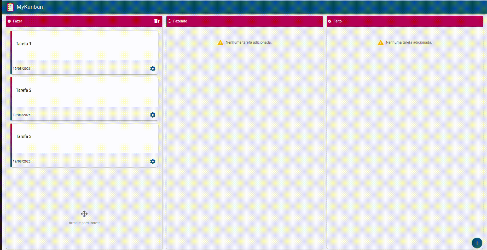

# MyKanban

Aplicação de gerenciamento de tarefas baseada no modelo Kanban, desenvolvida com Vue.js e Quasar Framework.

O projeto permite criar, editar, excluir e organizar tarefas entre diferentes etapas do fluxo de trabalho.

## Funcionalidades

- Criar tarefas
- Editar tarefas
- Excluir tarefas
- Excluir todas as tarefas de uma coluna
- Mover tarefas entre as colunas
- Reordenar tarefas dentro de uma coluna
- Persistir as tarefas utilizando JSON Server
- Interface responsiva para desktop e dispositivos móveis
- Feedback visual através de notificações
- Modal para movimentação de tarefas em dispositivos móveis

## Tecnologias

- Vue.js 3
- Quasar Framework
- JavaScript
- Axios
- Vue Draggable
- JSON Server
- Sass

## Estrutura do Kanban

As tarefas são organizadas em três etapas:

- **Fazer**
- **Fazendo**
- **Feito**

É possível mover uma tarefa entre as etapas e alterar sua posição dentro de cada coluna.

## Instalação

1. Clone o repositório:

git clone <https://github.com/giosantos99/MyKanban.git>

2. Entre na pasta do projeto:

cd to-do-drag-drop/app

3. Instale as dependências:

npm install

## Executando o projeto

O projeto utiliza o Quasar para o frontend e o JSON Server para simular a API.

## Frontend

Inicie a aplicação:

quasar dev ou npm run dev

O Quasar iniciará a aplicação em:

http://localhost:9000

## Backend (JSON Server)

Em outro terminal, dentro da pasta app, execute:

npm run api

O JSON Server será iniciado em:

http://localhost:3000

## Frontend + Backend

Para iniciar os dois simultaneamente:

npm run dev:all
